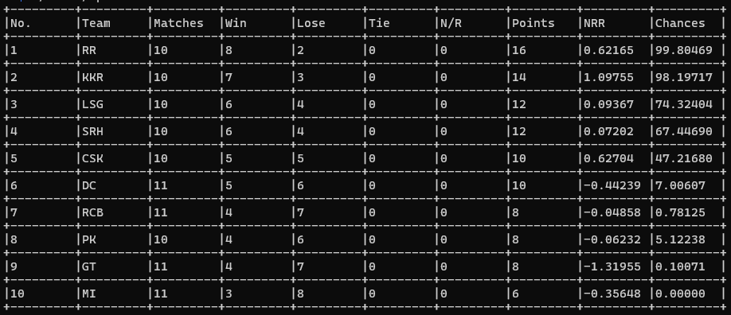

# IPL PLAYOFF CHANCES CALCULATOR

The program simulates all the possibilities of the reamining games and returns the possibilities of qualifying to playoffs. It uses a recursive algorithm which branches into two part depending on who wins. Note that it does not take into account of any sharing of points situation.

## Input
The program takes input from a csv file. Example of the same is given below:
```
| No | H_team | A_team | Result | H_runs | H_balls | A_runs | A_balls |
|----|--------|--------|--------|--------|---------|--------|---------|
| 1  | CSK    | RCB    | H      | 176    | 112     | 173    | 120     |
| 2  | PK     | DC     | H      | 177    | 116     | 174    | 120     |
| 3  | KKR    | SRH    | H      | 208    | 120     | 204    | 120     |
| 4  | RR     | LSG    | -      | -1     | -1      | -1     | -1      |
| 5  | GT     | MI     | -      | -1     | -1      | -1     | -1      |
```

## Output
The program will give following as output:


## How to Run?
```
1. Set up CMake in your system.
2. Run ./build.sh -r for release mode and ./build.sh -d for debug mode.
3. To run the program ./build/ipl
```